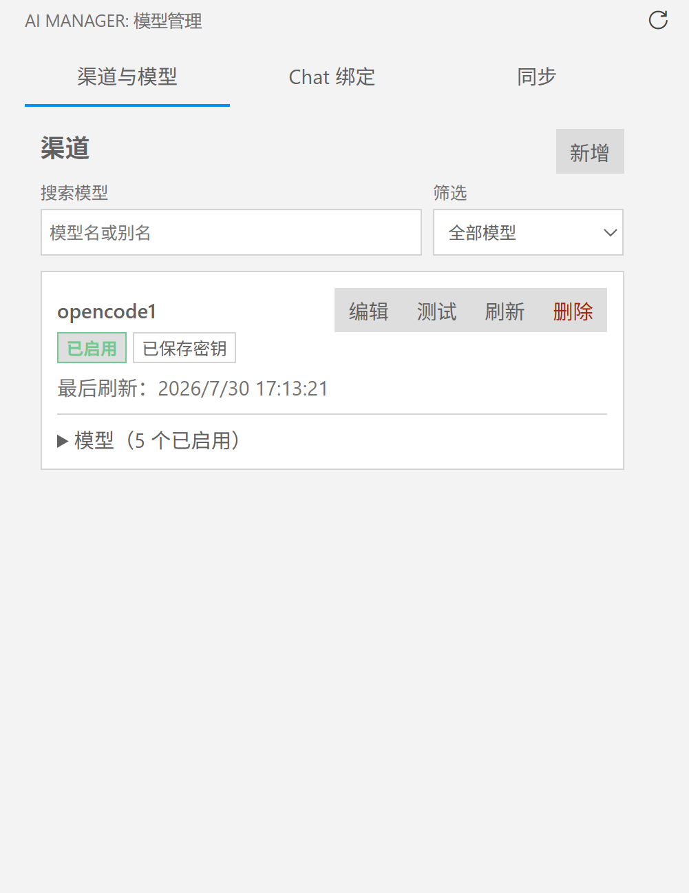
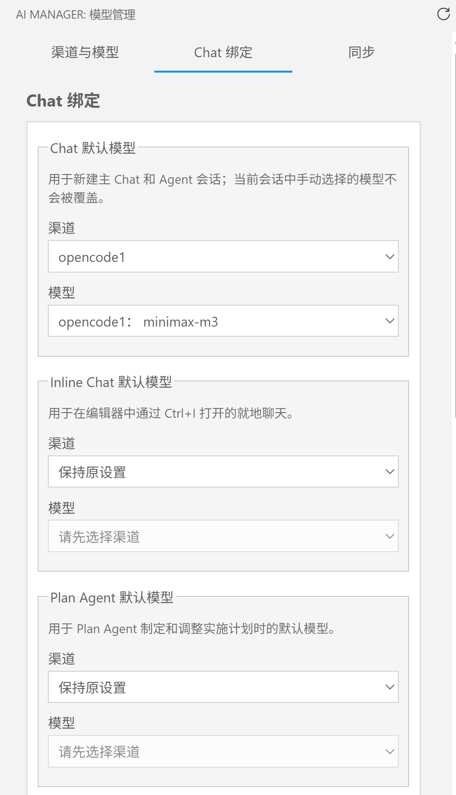

# AI Manager

[English](README.md) | [简体中文](README.zh-CN.md) | **日本語**

AI Manager は、OpenAI-compatible チャンネル、動的なモデルカタログ、VS Code ネイティブの Chat モデルバインディングを一元管理するための VS Code デスクトップ拡張機能です。

## 開発の背景

VS Code で AI 機能を使う際、コード補完や Git コミットメッセージの生成は通常 GitHub Copilot が既定で使用されます。ほかの AI モデルを使うには、複数の設定を手動で変更しなければならないことがあります。AI Manager は、AI モデルの接続、管理、切り替えを一つの画面に集約し、用途に応じて適切なモデルを柔軟に選べるようにするために開発しました。

VS Code 1.121.0 以降が必要です。

## 主な機能

- OpenCode Go、OpenCode Console、カスタム OpenAI-compatible チャンネルを管理します。
- モデルカタログを更新し、最後に正常取得したキャッシュを保持します。
- 検出したモデルのエイリアス、フィルター、メタデータ、有効状態を設定します。
- 有効なモデルを VS Code ネイティブの Chat モデルピッカーに登録します。
- Chat、Inline Chat、Plan、Plan 実装、Utility、Utility Small の各設定に個別のモデルを割り当てます。
- API Key を VS Code の `SecretStorage` に保存し、必要に応じて `Settings Sync` で暗号化して同期します。

## スクリーンショット

### チャンネルとモデルの管理



### Chat モデルのバインディング



## クイックスタート

1. Activity Bar から **AI Manager** を開きます。
2. チャンネルを追加し、Base URL、エンドポイントパス、認証方式、必要に応じて API Key を入力します。
3. チャンネルを更新してモデルカタログを読み込みます。
4. 検出されたモデルを確認し、必要に応じてエイリアスやメタデータを調整して、使用するモデルを有効にします。
5. AI Manager の Chat 設定ページを開き、管理する各設定にチャンネルとモデルを割り当てます。

新しく検出されたモデルはデフォルトで無効です。

## 対応プロトコル

| プロトコル | API | 一般的なエンドポイント |
| --- | --- | --- |
| OpenAI | Chat Completions | `/v1/chat/completions` |
| Anthropic | Messages | `/v1/messages` |
| Gemini | `streamGenerateContent` | `/v1beta/models/{model}:streamGenerateContent?alt=sse` |

カスタムチャンネルでは、3 つのプロトコルごとにエンドポイントを設定し、Bearer、`x-api-key`、`x-goog-api-key` のいずれかで認証できます。Gemini のエンドポイントには `{model}` プレースホルダーが必要です。

OpenCode Go は、既知のモデルファミリーに使用するプロトコルを自動判定します。モデルエディターでは、プロトコル、Token 上限、ツール呼び出し機能を手動で変更できます。

## デバイス間同期

AI Manager は、VS Code の `Settings Sync` を使用して、チャンネル、モデル設定、暗号化された API Key を同期できます。

同期を有効にすると、API Key は PBKDF2-SHA256 と AES-256-GCM で暗号化されてから同期ストレージに保存されます。マスターパスワードは保存されず、派生キーだけがローカルの `SecretStorage` に保存されます。

別のコンピューターでは、同じ VS Code アカウントでサインインして `Settings Sync` を有効にし、同じマスターパスワードで AI Manager を一度ロック解除します。パスワードを紛失した場合は Vault をリセットする必要があり、同期された暗号文とローカルの API Key は削除されます。

## 注意事項と制限

- Chat のデフォルトモデルは新しい会話に適用され、既存の会話で手動選択したモデルを置き換えません。
- Plan 実装モデルは VS Code の試験的な設定を使用するため、VS Code のバージョンや組織ポリシーによって利用できない場合があります。
- 無効、利用不可、またはプロトコルのエンドポイントが未設定のモデルは、ネイティブのモデルピッカーに表示されません。

## プライバシー

リクエストログに記録されるのは、チャンネル、エイリアス、モデル ID、処理時間、HTTP ステータス、エラーカテゴリだけです。AI Manager は、プロンプト、レスポンス本文、認証情報、同期用マスターパスワード、派生キーをログに記録せず、ローカルの OpenCode 認証ファイルも読み取りません。

## 開発

```powershell
npm install
npm run check
npm run package:vsix
```

単体テストには `npm test`、Extension Host 統合テストには `npm run test:integration` を使用します。VS Code で `F5` を押すと Extension Development Host を起動できます。
